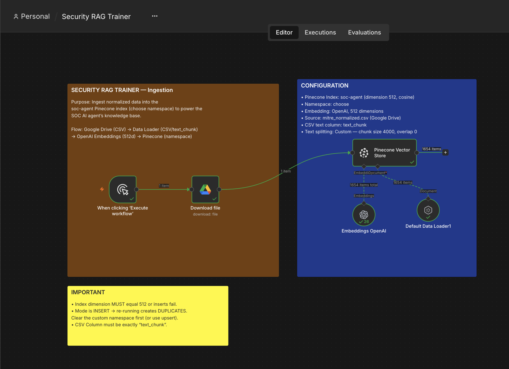
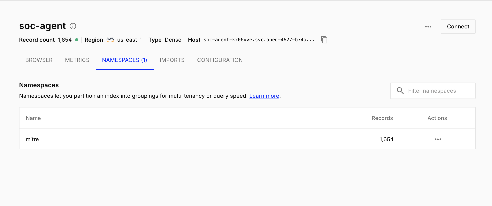

# Security Oriented RAG Knowledge Trainer

**A generalised data engineering pipeline for ingesting, normalizing, and vectorizing diverse cybersecurity knowledge into Pinecone for AI-driven Security Operations Centers (SOC).**


## Overview
Building a Retrieval-Augmented Generation (RAG) system for a SOC requires feeding the AI multiple types of knowledge: Threat Intelligence, Internal SOPs, Tool Syntax, and Infrastructure Context. 

Most RAG implementations fail because they blindly dump raw PDFs or massive JSON files into a vector database, leading to hallucinations and poor retrieval. Within this project I wanted to focus on ensuring I had not faces any issues with **ETL (Extract, Transform, Load) bottleneck** for AI SOC Agents. 

It utilises local Python scripts to pre-chunk and normalize complex data sources into clean CSVs, and a reusable **n8n workflow template** to automatically embed and upsert that data into isolated Pinecone namespaces.

## Architecture: The "SOC Brain"

The system uses a single Pinecone Index (`soc-agent`) divided into isolated Namespaces to prevent cross-contamination of knowledge domains.

```mermaid
graph TD
    subgraph Data Sources
    A1[MITRE STIX 2.1 JSON]
    A2[Internal SOPs / PDFs]
    A3[Elastalert Queries]
    end

    subgraph Python ETL Layer
    B1[Normalize & Pre-Chunk] --> C[(Google Drive CSVs)]
    end

    subgraph n8n Orchestration Layer
    C --> D[n8n: Binary Data Loader]
    D --> E[OpenAI Embeddings 512d]
    end

    subgraph Pinecone Vector DB (soc-agent)
    E -->|Namespace: Mitre| F1[(Threat Intel)]
    E -->|Namespace: SOPs| F2[(Playbooks)]
    E -->|Namespace: Tools| F3[(Query Syntax)]
    end
```

## Key Engineering Decisions

1. **Pre-Chunking via Python (ETL):** 
   Instead of relying on n8n's text splitters to blindly chop up 16MB JSON files or 50-page PDFs, custom Python scripts parse the data and output clean CSVs. Each row represents a perfect, semantic "chunk" (e.g., one MITRE technique, or one specific Elastalert rule).
2. **Binary Data Processing in n8n:** 
   The n8n workflow downloads CSVs as **Binary Files** to prevent browser memory crashes. The `Default Data Loader` is configured to target the specific `text_chunk` CSV column, ensuring rows are passed cleanly to the embedding model.
3. **Namespace Isolation Strategy:** 
   Data is routed to specific namespaces (`Mitre`, `SOPs`, `Tools`). This allows the AI Agent to perform targeted retrieval (e.g., *"Only search the `Tools` namespace for Splunk queries related to this alert"*).
4. **Matryoshka Embeddings (512d):** 
   Utilizes OpenAI's `text-embedding-3-small` with dimensions reduced to 512. This cuts Pinecone storage costs and search latency by ~66% while retaining >95% of the semantic accuracy required for technical threat intel.

## How to Use This Pipeline

This n8n workflow acts as a **Universal Loader**. To train a new part of the SOC brain:

1. **Write a Python Script:** Create a script in the `/scripts` folder to parse your new data source and output a CSV with `id`, `text_chunk`, and metadata columns.
2. **Upload to Drive:** Push the CSV to Google Drive.
3. **Clone the n8n Workflow:** Duplicate `soc-knowledge-loader.json`.
4. **Update Parameters:** Change the Google Drive File ID and the Pinecone Namespace (e.g., change `Mitre` to `SOPs`).
5. **Execute:** The AI's knowledge base is instantly updated.

## Workflow Visuals

| n8n Universal Loader Template | Pinecone Namespace Isolation |
| :---: | :---: |
|  |  |

##  Roadmap
- [x] **Phase 1:** Core n8n Loader Architecture & MITRE Ingestion
- [x] **Phase 2:** Dimensionality Reduction (512d) Optimization
- [ ] **Phase 3:** Internal SOP & Playbook Ingestion Pipeline
- [ ] **Phase 4:** Automated Duplicate Handling (Clear & Insert logic)
- [ ] **Phase 5:** The Retrieval Agent (Connecting Wazuh alerts to this Knowledge Base)

## 📄 License
MIT License. Free to use and adapt for your own security automation pipelines.

